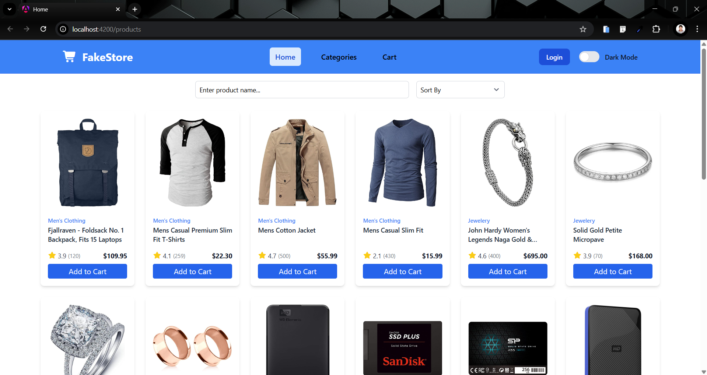
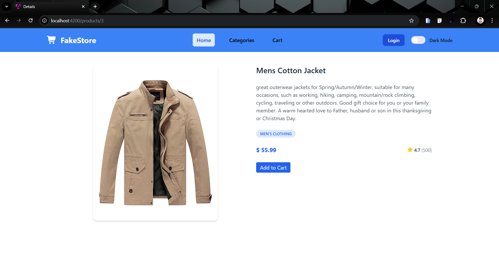
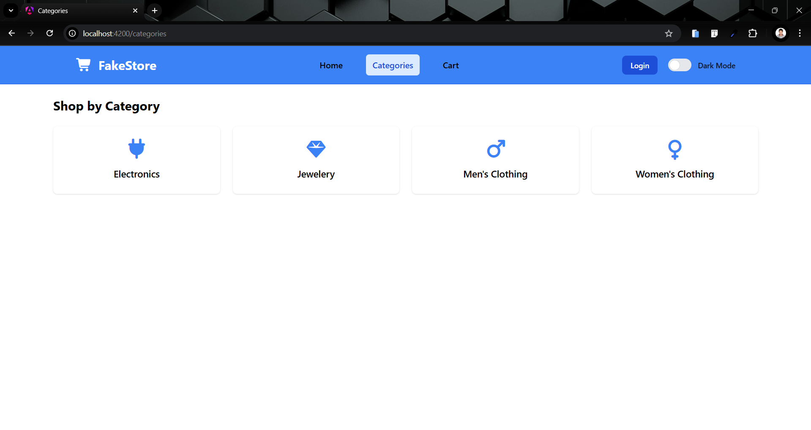
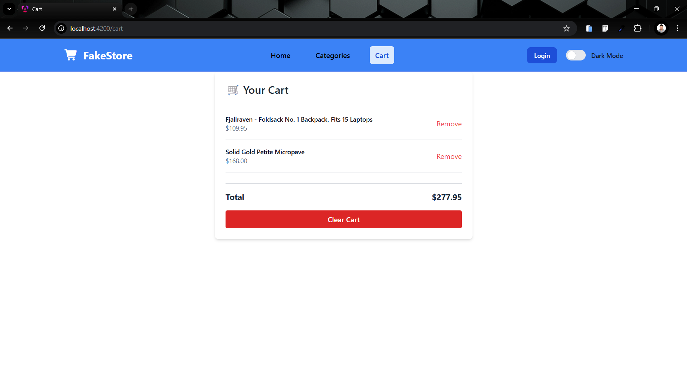
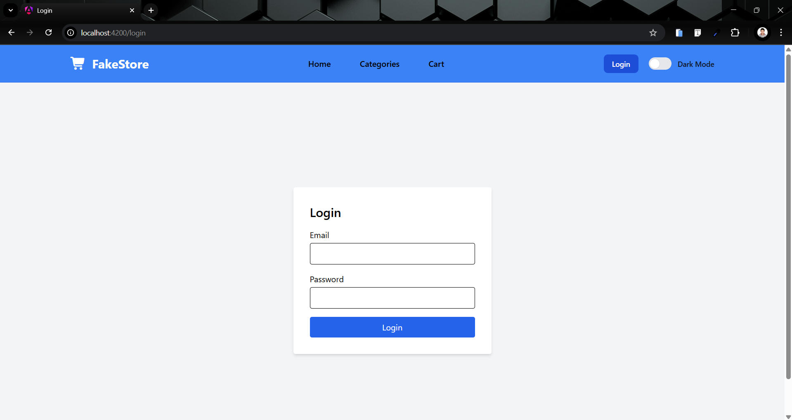

🛍️ Angular Shop App
An e-commerce front-end built with Angular 20.1.3, showcasing modern component design, routing, services, cart management, and reactive forms.

📦 Features
✅ Product listing with filtering

✅ Product detail pages

✅ Add to cart & cart management

✅ Toast notifications for feedback

✅ Skeleton loader during API fetch

✅ Placeholder login & registration forms using Reactive Forms

✅ Fully responsive & styled with Tailwind CSS

🛠️ Tech Stack
Tech	            Description
Angular 20.1.3	    Core framework
TypeScript	        Primary language
Tailwind CSS	    Utility-first CSS framework
Reactive Forms	    Login form handling
Toastr          	User notifications
Fake Store API  	Product data (https://fakestoreapi.com)

🚀 Getting Started
Prerequisites
Node.js >= 18

Angular CLI

Setup
bash
Copy
Edit
git clone https://github.com/Marawan-Ali/FakeStore
cd angular-shop-app
npm install
ng serve
🔧 Project Structure
bash
Copy
Edit
src/
├── app/
│   ├── core/          # Services and core logic (e.g. cartService)
│   ├── features/      # Pages (products, cart, auth)
│   ├── shared/        # Shared UI components
│   ├── app-routing    # Routes configuration
│   └── app.component  # Root component
📍 Notes
This is a front-end demo app.

Login form is implemented using Reactive Forms, but not yet connected to a backend.

📸 Screenshots

🛍️ Products Page

📄 Product Details

🌙 Dark Mode

🗂️ Categories

🛒 Cart

🔐 Login Page

